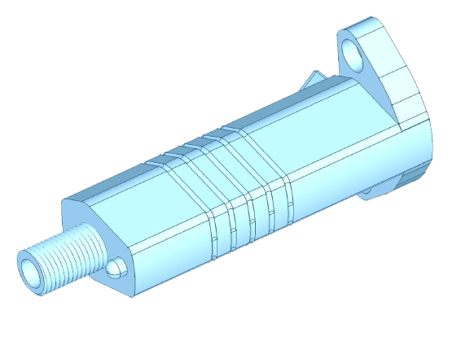

# Triumph Indicator Stalk

Fitment:
- 750/900/1000/1200 Daytona, Super III
- 750/900 Speed Triple
- 750/900 Trident
- Trophy 900/1200 (up to VIN 29155)
- Tiger 900 carburettor model.

## How to use this repository.

There's a .FCStd file in here which is the CAD file, use this, but make sure you install the [ThreadProfile](https://github.com/mwganson/ThreadProfile) workbench.

If you don't want to use FreeCAD, just take the STL file from this directory and drop it in your printer.

## Mechanical Stability

The original part is a metal threaded nut, overmolded with plastics (or hard rubbers). This is great, and is a super technique. It's hard to reproduce at home, however accessible molding rubers (2 part PUs).

I 3d printed this in PPA-CF, a material which claims to be stronger than metal when properly printed, and annealed.

Manufacturer guidelines vary, but essentially heat-soak the chamber for 30 mins to get as high ambient chamber temp as possible, then print per manufacturers guidelines, then anneal (i.e on heatbed under a box at 100C) for 6-10 hours.